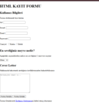

# HTML KAYIT FORMU
aşağıda form görselini bulabilirsiniz

Bu proje, basit bir HTML kayıt formu oluşturmaktadır. Kullanıcıların kişisel bilgilerini girmelerine ve formu göndermelerine olanak tanır.

## Kullanılan Teknolojiler
- HTML5
- CSS (Inline Style kullanılmıştır)

## Form İçeriği
Form aşağıdaki bölümlerden oluşmaktadır:

1. **Kullanıcı Bilgileri**
   - Ad
   - Soyad
   - Email
   - Parola
   - Cinsiyet (Kadın/Erkek seçeneği)

2. **En Sevdiğiniz Meyve**
   - Kullanıcıdan en sevdiği meyveyi seçmesi beklenir. Seçenekler: Elma, Armut, Muz, Çilek, Karpuz.

3. **Cover Letter**
   - Kullanıcı kendisini tanıtan bir metin yazabilir.

4. **Form İşlemleri**
   - **Formu Temizle**: Tüm alanları sıfırlar.
   - **Formu Gönder**: Girilen bilgileri `/submit_form.html` adresine gönderir (GET yöntemi ile).

## Kullanım
Bu formu kullanmak için dosyayı bir tarayıcıda açmanız yeterlidir. Kullanıcılar gerekli bilgileri girdikten sonra "Formu Gönder" butonuna tıklayarak bilgilerini gönderebilirler.

## Geliştirme Önerileri
- Formun daha şık bir görünüm kazanması için harici bir CSS dosyası eklenebilir.
- Form verileri bir sunucu tarafında işlenerek kaydedilebilir.
- JavaScript ile form doğrulama işlemi gerçekleştirilebilir.

